# Tasks

Tasks adds recurring household tasks to Home Assistant. Tasks can be assigned, scheduled, completed with notes, and linked to files or NFC tags.

[](https://my.home-assistant.io/redirect/hacs_repository/?owner=psym88&repository=ha_tasks&category=integration)

## Features

- Daily, weekly, monthly, and yearly recurring tasks
- Fixed schedules with a local time, intervals after completion, and binary problem-sensor triggers
- Preview of the actual upcoming due dates and times calculated from each schedule
- Task pausing from individual and bulk action menus
- Home Assistant user and label assignments, notes, history, and attachments
- Optional NFC tag completion
- Sidebar panel and configurable dashboard card
- A due-task summary sensor
- Home Assistant events for task, history, and attachment changes
- ZIP backup and restore
- English and German interface

## Installation

Tasks requires Home Assistant 2026.7.0 or newer.

1. Use the button above, or add `https://github.com/psym88/ha_tasks` to HACS as an **Integration** repository.
2. Install Tasks and restart Home Assistant.
3. Open **Settings → Devices & services → Add integration** and select **Tasks**.

Only one Tasks configuration entry can be created.

### Removal

1. Open **Settings → Devices & services**, select **Tasks**, and delete the integration entry.
2. Remove Tasks from HACS.
3. Restart Home Assistant.

Removing the integration does not delete exported backups. Tasks data in `<config>/.storage/tasks` and attachments in `<config>/tasks/uploads` can be removed manually if they are no longer needed.

## Usage

Administrators can open **Tasks** in the sidebar. Use **+ Add task** to create a task. Select a task to view and complete it; use its three-dot menu to pause, resume, edit, or delete it. Paused tasks remain in the task table with a red pause icon and no displayed due value.

The task table supports configurable columns, search, sorting, and filters for assignee, labels, notification targets, recurrence calculation, and rhythm.

Task details show the due date and time, assignee, labels, attachments, completion history, and notes in one dialog.

| Light | Dark |
| --- | --- |
| 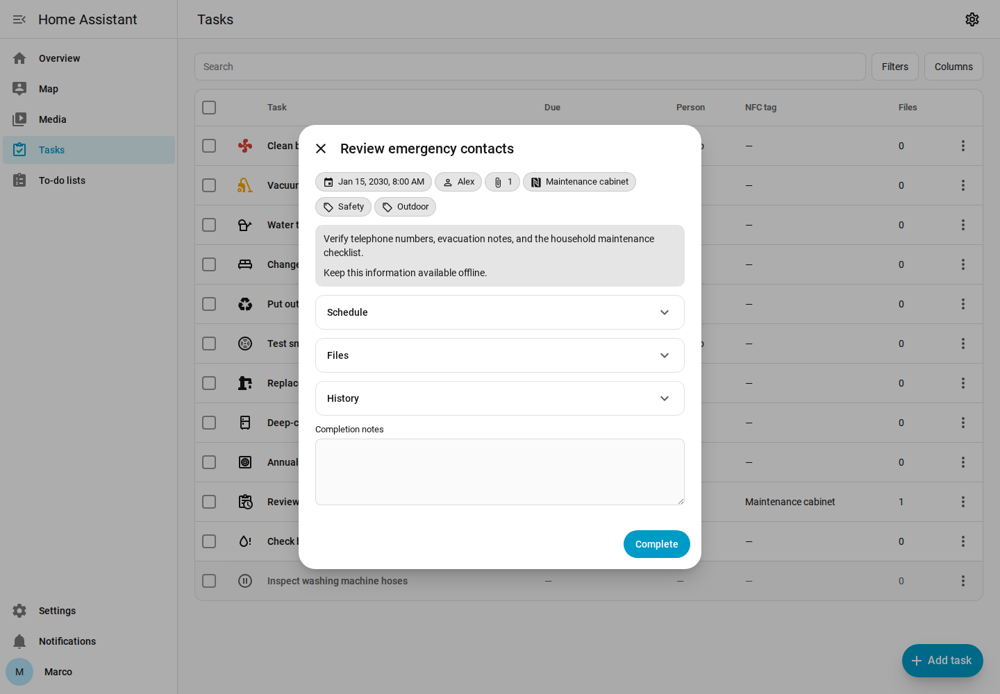 | 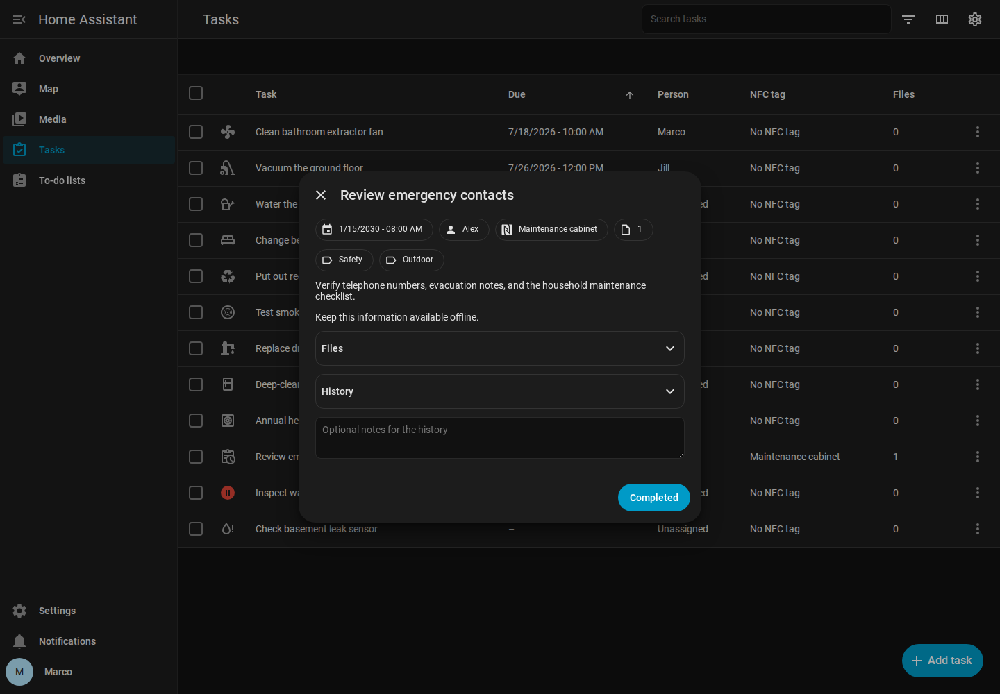 |

Tasks can be triggered by a fixed calendar schedule, from the last completion, or when a binary problem sensor turns on. Files are managed in the task editor and supported formats open in an in-panel preview dialog.

Select **+ Add task** to open an empty editor:

| Light | Dark |
| --- | --- |
| 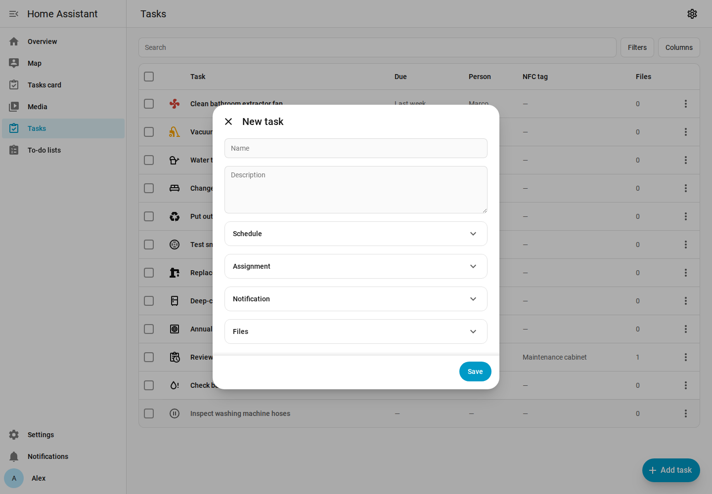 | 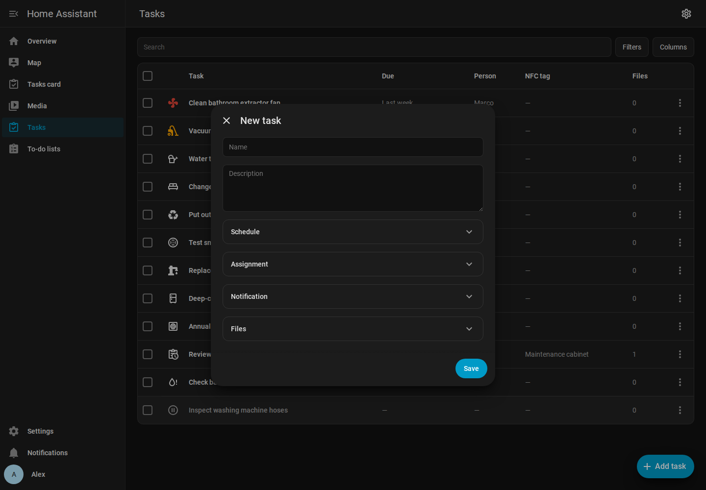 |

The editor groups the settings for an existing task into separate expandable sections.

**Schedule**

| Light | Dark |
| --- | --- |
| 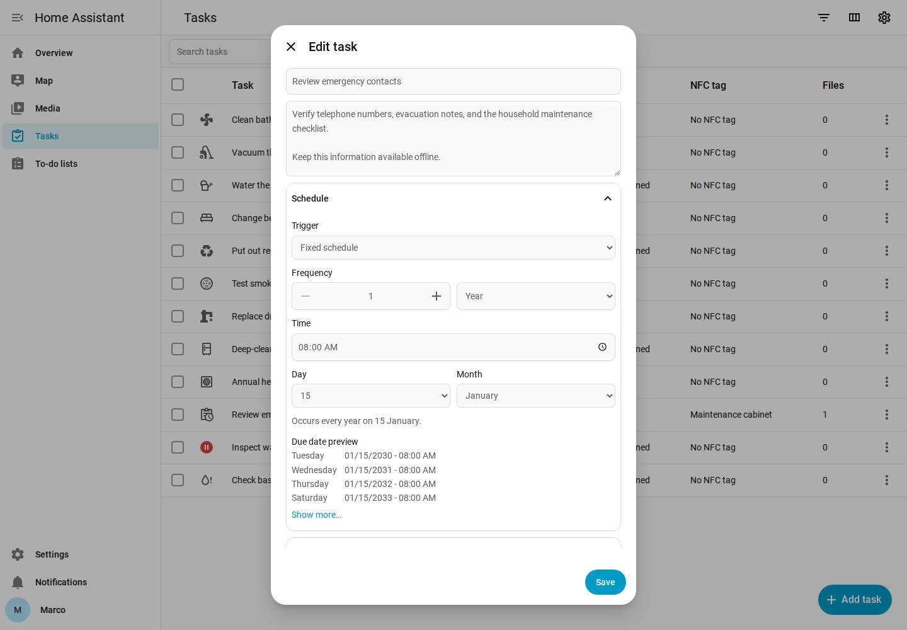 | 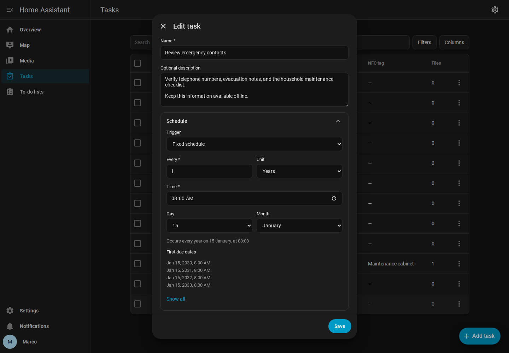 |

**Assignment**

| Light | Dark |
| --- | --- |
| 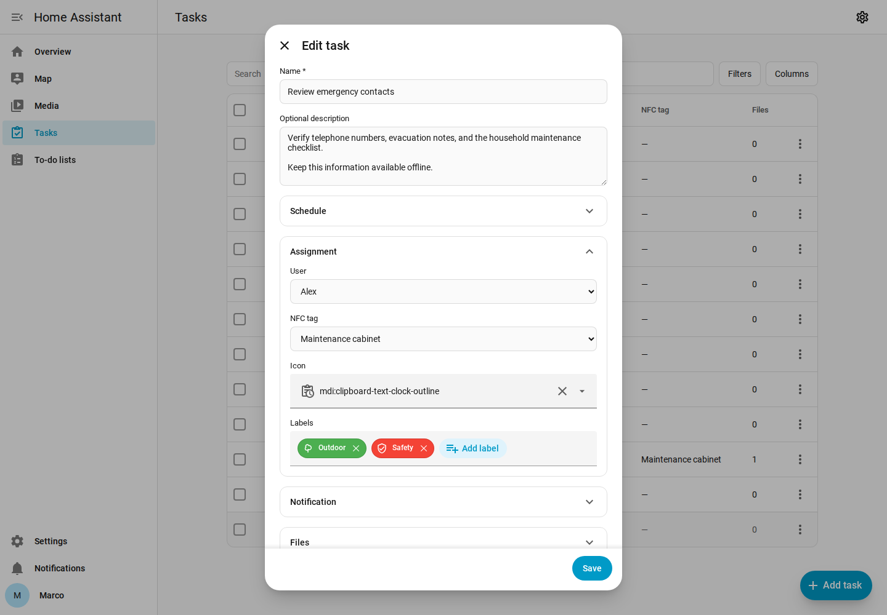 | 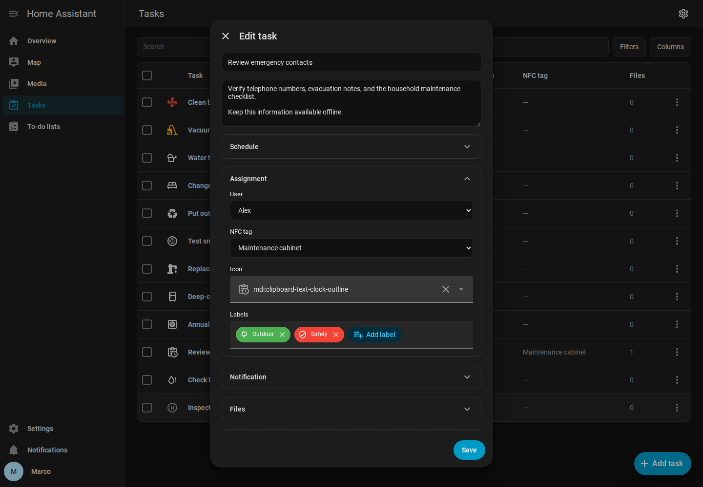 |

**Notification**

| Light | Dark |
| --- | --- |
| 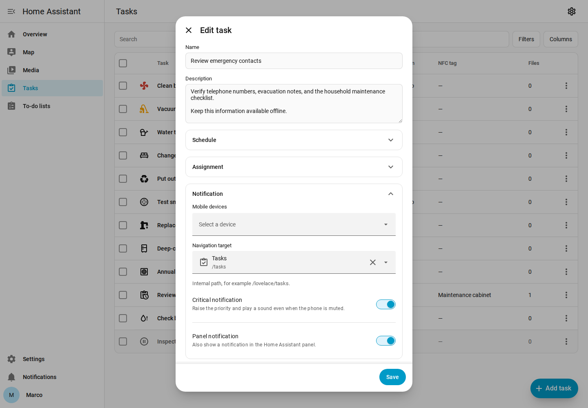 | 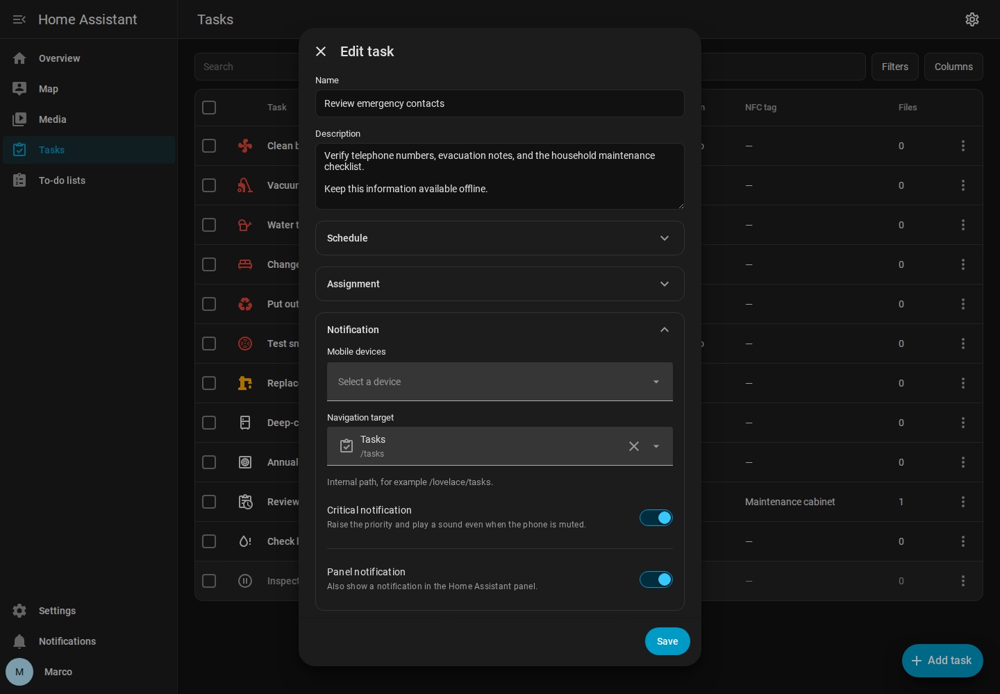 |

**Files**

| Light | Dark |
| --- | --- |
| 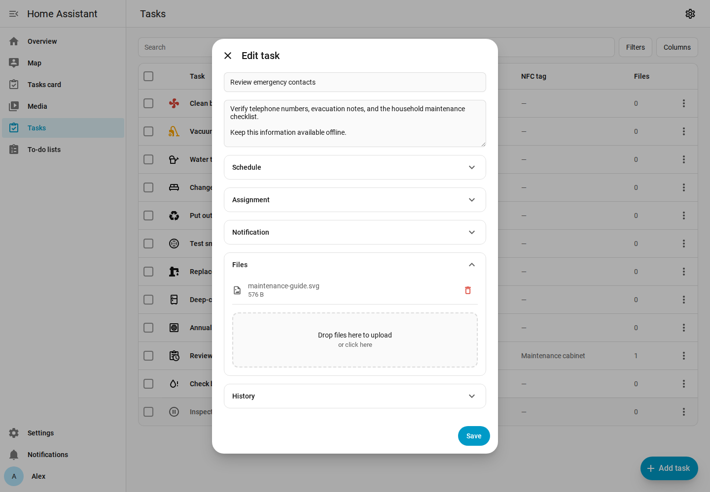 | 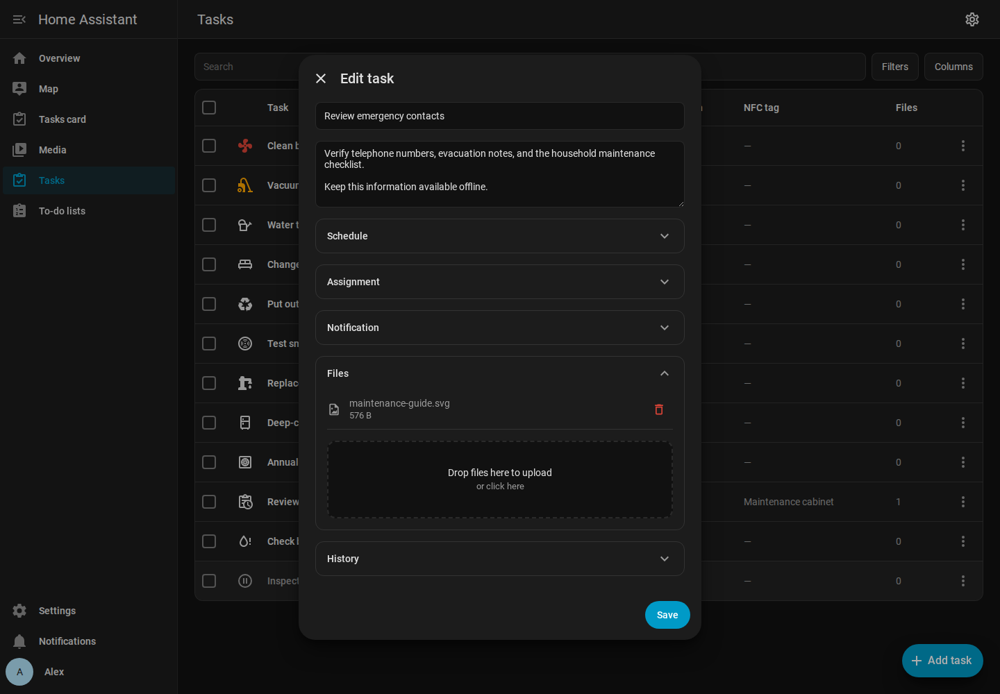 |

**History**

| Light | Dark |
| --- | --- |
| 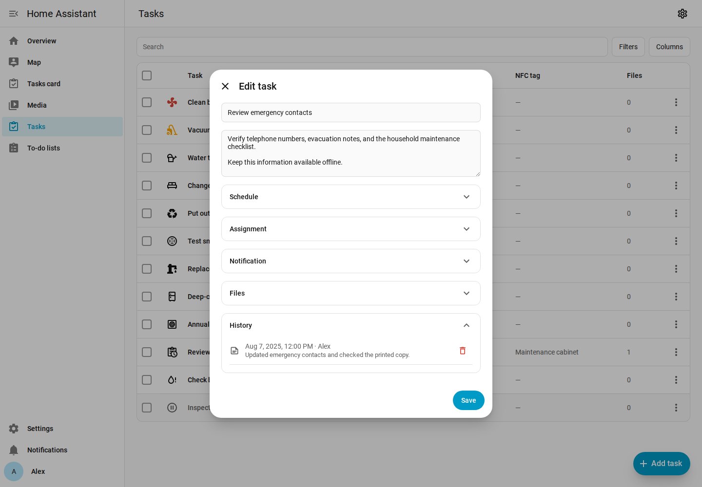 | 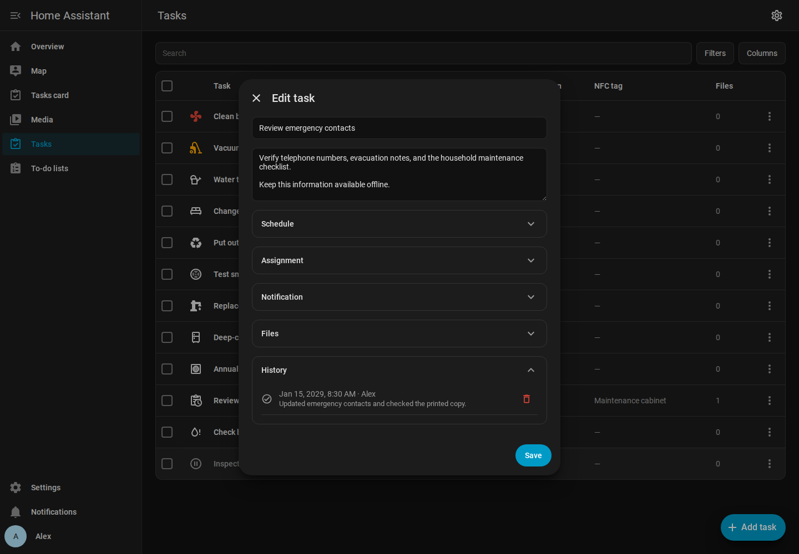 |

To complete a task with NFC, create a tag under **Settings → Tags** and assign it in the task editor. One tag can be assigned to only one task.

### Dashboard card

Add the **Tasks** card from the dashboard card picker. Its visual editor controls view/edit mode, the due-date range, and assignee filters. The assignee dropdown can dynamically target the logged-in user or selected users. Open panels and cards update immediately through the Tasks WebSocket subscription.

| Light | Dark |
| --- | --- |
| 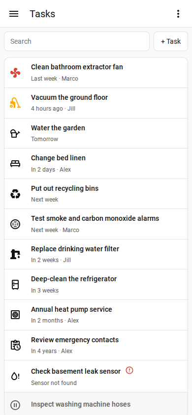 | 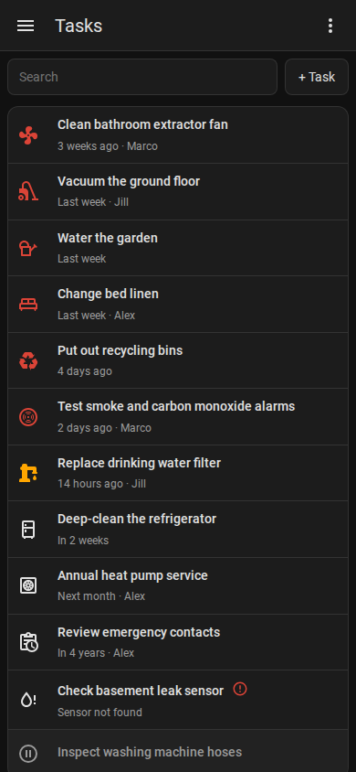 |

Paused tasks are hidden from the dashboard card. Resuming a task keeps its stored due value, so an overdue task can immediately appear as due again.

### Backup and restore

Open **Settings** above the task list and expand **Backup**. Export creates a ZIP archive containing all data and attachments from Tasks. Import validates the archive and adds only tasks with new IDs together with their history and conflict-free attachments. Existing tasks and files are never overwritten.

## Home Assistant entities

The `sensor.tasks_due` entity counts active tasks whose due date and time has been reached and belongs to the **Tasks** device.

Example badge for [Navbar Card](https://github.com/joseluis9595/lovelace-navbar-card):

```yaml
badge:
  count: |
    [[[
      return Number(states['sensor.tasks_due']?.state || 0);
    ]]]
  show: |
    [[[
      return Number(states['sensor.tasks_due']?.state || 0) > 0;
    ]]]
```

## Home Assistant events

Tasks fires `tasks_event` after every committed operation and when a task reaches its due time. Automations can filter its `resource_type` and `action` data. Resource types are `task` and `archive`. Task actions are `saved`, `updated`, `deleted`, `completed`, `bulk_mutated`, and `due`; archive imports use `imported`. A newly saved task has `created: true`.

To receive a notification when a task becomes due, create an automation, open **Edit in YAML**, and paste:

```yaml
alias: Tasks task is due
triggers:
  - trigger: event
    event_type: tasks_event
    event_data:
      resource_type: task
      action: due
actions:
  - action: notify.notify
    data:
      title: Tasks
      message: "{{ trigger.event.data.resource_name }} is due."
```

Every event includes `resource_id` when the changed resource has one. Single-task events also include `resource_name`; bulk operations describe their task IDs in `operations`.

## Data and support

Tasks stores task data locally in Home Assistant and attachments under `<config>/tasks/uploads`. It does not send task data to an external service.

- [Issues and feature requests](https://github.com/psym88/ha_tasks/issues)
- [Release history](https://github.com/psym88/ha_tasks/releases)
- [Maintainer development and release workflow](CONTRIBUTING.md)
- [Architecture](ARCHITECTURE.md)
- [MIT License](LICENSE)
