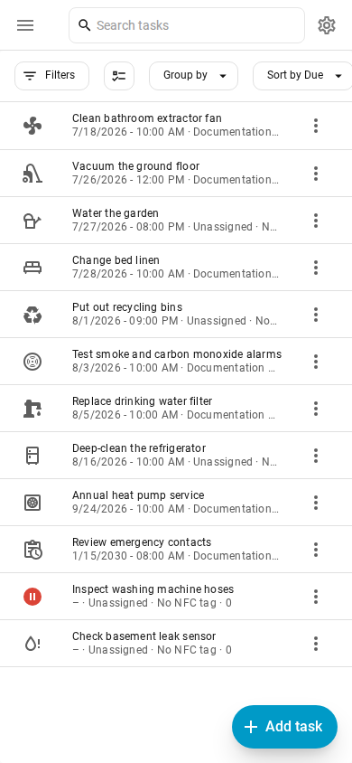
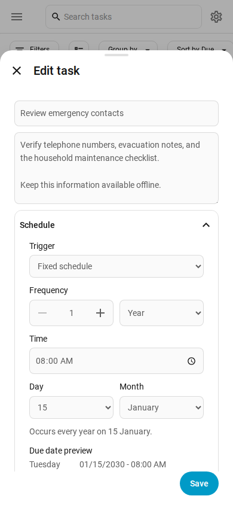
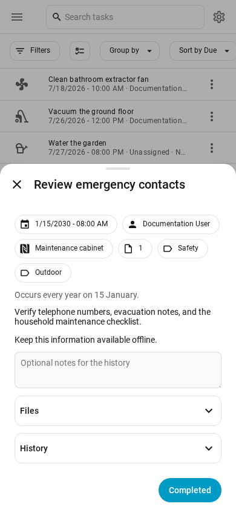

# Tasks

Tasks adds recurring household tasks to Home Assistant. Tasks can be assigned, scheduled, completed with notes, and linked to files or NFC tags.

[](https://my.home-assistant.io/redirect/hacs_repository/?owner=psym88&repository=ha_tasks&category=integration)

## Features

- Daily, weekly, monthly, and yearly recurring tasks
- Calendar-based schedules or intervals after completion
- Preview of the actual upcoming due dates calculated from each schedule
- Home Assistant user and label assignments, notes, history, and attachments
- Optional NFC tag completion
- Sidebar panel and configurable dashboard card
- A native Tasks to-do list and due-task summary sensor
- Home Assistant events for task, history, and attachment changes
- ZIP backup and restore
- English and German interface

## Installation

Tasks requires Home Assistant 2026.7.0 or newer.

1. Use the button above, or add `https://github.com/psym88/ha_tasks` to HACS as an **Integration** repository.
2. Install Tasks and restart Home Assistant.
3. Open **Settings → Devices & services → Add integration** and select **Tasks**.

Only one Tasks configuration entry can be created.

### Removal

1. Open **Settings → Devices & services**, select **Tasks**, and delete the integration entry.
2. Remove Tasks from HACS.
3. Restart Home Assistant.

Removing the integration does not delete exported backups. Tasks data in `<config>/.storage/tasks` and attachments in `<config>/tasks/uploads` can be removed manually if they are no longer needed.

## Usage

Administrators can open **Tasks** in the sidebar. Use **+ Add task** to create a task. Select a task to view and complete it; use its three-dot menu to edit or delete it.

The task table shows Label directly after Task and supports search, sorting, grouping by labels, recurrence, or assignee, and independent filters for those same dimensions.

<picture>
  <source media="(prefers-color-scheme: dark)" srcset="docs/images/task-list-dark.png">
  <source media="(prefers-color-scheme: light)" srcset="docs/images/task-list-light.png">
  
</picture>

Schedules can repeat by calendar or from the last completion. The optional start date limits when a recurrence begins. Files are managed in the task editor and supported formats open in an in-panel preview dialog.

<picture>
  <source media="(prefers-color-scheme: dark)" srcset="docs/images/schedule-preview-dark.png">
  <source media="(prefers-color-scheme: light)" srcset="docs/images/schedule-preview-light.png">
  
</picture>

Task details show the due date, assignee, labels, attachments, completion history, and notes in one dialog.

<picture>
  <source media="(prefers-color-scheme: dark)" srcset="docs/images/task-details-dark.png">
  <source media="(prefers-color-scheme: light)" srcset="docs/images/task-details-light.png">
  
</picture>

To complete a task with NFC, create a tag under **Settings → Tags** and assign it in the task editor. One tag can be assigned to only one task.

### Dashboard card

Add the **Tasks** card from the dashboard card picker. Its visual editor controls view/edit mode, the due-date range, and assignee filters. The assignee dropdown can dynamically target the logged-in user or selected users. Open panels and cards update immediately when Tasks emits an event.

### Backup and restore

Open **Settings** above the task list and expand **Backup**. Export creates a ZIP archive containing all data and attachments from Tasks. Import validates the archive and adds only tasks with new IDs together with their history and conflict-free attachments. Existing tasks and files are never overwritten.

## Home Assistant entities

All tasks are exposed as items of the native `todo.tasks` entity. Home Assistant can create, edit, complete, and delete these items using its standard to-do dashboard, actions, and triggers. Item `uid`, `summary`, `description`, and `due` map to the integration's `task_id`, `task_name`, `task_description`, and `task_due`. `task_due` accepts a native ISO date for an all-day task or an ISO datetime for an exact due time. Recurrence, user and label assignments, NFC tags, attachments, and completion history remain in the Tasks store.

The `sensor.tasks_due` entity counts tasks whose due date or due time has been reached. The state of `todo.tasks` itself is Home Assistant's standard count of all incomplete items. The to-do and due sensor entities belong to the shared **Tasks** device.

Example badge for [Navbar Card](https://github.com/joseluis9595/lovelace-navbar-card):

```yaml
badge:
  count: |
    [[[
      return Number(states['sensor.tasks_due']?.state || 0);
    ]]]
  show: |
    [[[
      return Number(states['sensor.tasks_due']?.state || 0) > 0;
    ]]]
```

## Home Assistant events

Tasks fires `tasks_event` after every stored change and when a task reaches its due time. Automations can filter its `resource_type` and `action` data. Resource types are `task`, `history`, `attachment`, and `archive`; actions are `created`, `updated`, `deleted`, `completed`, `imported`, and `task_due` where applicable.

To receive a notification when a task becomes due, create an automation, open **Edit in YAML**, and paste:

```yaml
alias: Tasks task is due
triggers:
  - trigger: event
    event_type: tasks_event
    event_data:
      resource_type: task
      action: task_due
actions:
  - action: notify.notify
    data:
      title: Tasks
      message: "{{ trigger.event.data.resource_name }} is due."
```

Every event includes `resource_id` when the changed resource has one. Task events also include `resource_name`; related identifiers such as `task_id` are included when available.

## Data and support

Tasks stores task data locally in Home Assistant and attachments under `<config>/tasks/uploads`. It does not send task data to an external service.

- [Issues and feature requests](https://github.com/psym88/ha_tasks/issues)
- [Release history](https://github.com/psym88/ha_tasks/releases)
- [Architecture](ARCHITECTURE.md)
- [MIT License](LICENSE)
